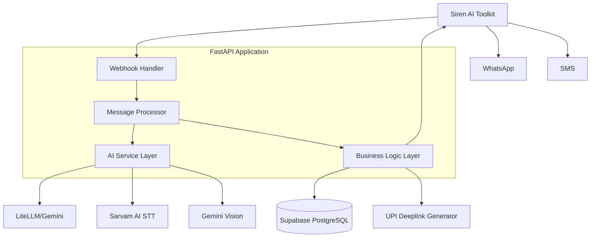
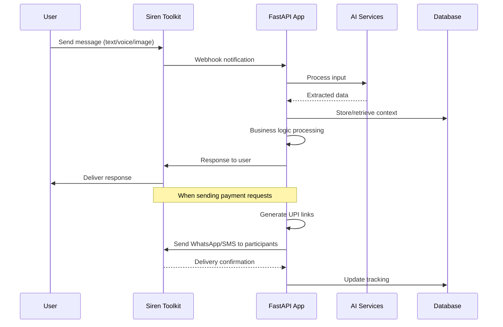
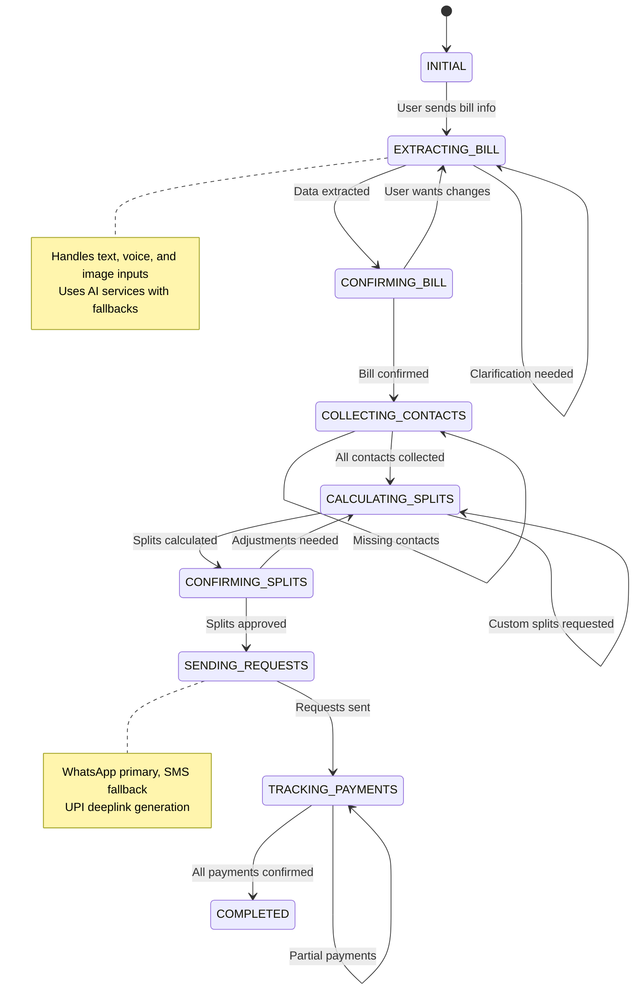

# Design Document

## Overview

The Bill Splitting Agent is a conversational AI system built on FastAPI that integrates with Siren's AI Agent Toolkit to provide intelligent bill splitting capabilities through WhatsApp and SMS. The system uses a microservices architecture with clear separation between input processing, business logic, and external integrations. The agent maintains conversation state and leverages multiple AI services for natural language understanding, speech recognition, and image processing.

## Architecture

### High-Level Architecture



### Component Interaction Flow



## Conversation Flow Management

### State Machine Design

The conversation flow follows a well-defined state machine to handle the multi-step bill splitting process:



### Context Management

```python
class ConversationManager:
    async def process_message(self, user_id: str, message: Message) -> Response:
        """Main conversation orchestrator implementing requirements 1-6"""
        state = await self.get_conversation_state(user_id)
        
        try:
            if state.current_step == ConversationStep.INITIAL:
                return await self.handle_initial_input(state, message)
            elif state.current_step == ConversationStep.EXTRACTING_BILL:
                return await self.handle_bill_extraction(state, message)
            elif state.current_step == ConversationStep.CONFIRMING_BILL:
                return await self.handle_bill_confirmation(state, message)
            # ... other state handlers
            
        except Exception as e:
            return await self.handle_error(state, e)
        finally:
            await self.save_conversation_state(state)
```

## Components and Interfaces

### 1. Message Processing Layer

**WebhookHandler**
- Receives webhook events from Siren AI Toolkit
- Validates webhook signatures
- Routes messages to appropriate processors
- Handles delivery status updates from Siren

**MessageProcessor**
- Manages conversation state and context
- Coordinates between AI services and business logic
- Implements conversation flow state machine
- Handles message queuing and retry logic
- Provides graceful degradation when external services fail

**ConversationState**
```python
class ConversationStep(Enum):
    INITIAL = "initial"
    EXTRACTING_BILL = "extracting_bill"
    CONFIRMING_BILL = "confirming_bill"
    COLLECTING_CONTACTS = "collecting_contacts"
    CALCULATING_SPLITS = "calculating_splits"
    CONFIRMING_SPLITS = "confirming_splits"
    SENDING_REQUESTS = "sending_requests"
    TRACKING_PAYMENTS = "tracking_payments"
    COMPLETED = "completed"

class ConversationState(BaseModel):
    user_id: str
    session_id: str
    current_step: ConversationStep
    bill_data: Optional[BillData]
    participants: List[Participant]
    context: Dict[str, Any]
    retry_count: int = 0
    last_error: Optional[str] = None
    created_at: datetime
    updated_at: datetime
```

### 2. AI Service Layer

**InputProcessor**
- Text processing using LiteLLM/Gemini for intent recognition
- Voice-to-text conversion using Sarvam AI
- Image processing using Gemini Vision for bill extraction
- Unified interface for all input types

**BillExtractor**
```python
class BillExtractor:
    async def extract_from_text(self, text: str) -> BillData
    async def extract_from_image(self, image_data: bytes) -> BillData
    async def extract_from_voice(self, audio_data: bytes) -> BillData
    async def validate_extraction(self, bill_data: BillData) -> ValidationResult
```

### 3. Business Logic Layer

**BillManager**
- Handles bill creation, splitting calculations
- Manages participant addition and contact resolution
- Validates split amounts and business rules
- Coordinates payment request generation

**ContactManager**
- Stores and retrieves contact information
- Handles contact deduplication and validation
- Manages contact privacy and data retention
- Provides contact suggestions based on history

**PaymentTracker**
- Generates UPI deeplinks with proper formatting
- Tracks payment request status and confirmations
- Handles payment notifications and updates
- Manages payment history and reporting
- Provides bill status queries and history retrieval (Requirement 6)

**BillQueryService**
```python
class BillQueryService:
    async def get_user_bills(self, user_id: str, filters: BillFilters) -> List[BillSummary]:
        """Implements requirement 6.1 for bill history retrieval"""
        
    async def get_bill_status(self, user_id: str, bill_id: str) -> BillStatus:
        """Implements requirement 6.2 for payment status display"""
        
    async def get_bill_details(self, user_id: str, bill_id: str) -> BillDetails:
        """Implements requirement 6.3 for complete bill information"""
        
    async def send_payment_reminders(self, user_id: str, bill_id: str, participant_ids: List[str]):
        """Implements requirement 6.4 for resending payment requests"""
```

### 4. Data Models

**Core Models**
```python
class BillData(BaseModel):
    total_amount: Decimal
    description: str
    items: List[BillItem]
    currency: str = "INR"
    date: Optional[datetime]
    merchant: Optional[str]

class Participant(BaseModel):
    name: str
    phone_number: str
    amount_owed: Decimal
    payment_status: PaymentStatus
    contact_id: Optional[str]

class PaymentRequest(BaseModel):
    id: str
    bill_id: str
    participant_id: str
    amount: Decimal
    upi_link: str
    status: PaymentStatus
    sent_via: List[str]  # ["whatsapp", "sms"]
    created_at: datetime
    paid_at: Optional[datetime]
```

### 5. External Service Integrations

**UPI Integration**
- Generate UPI deeplinks with proper formatting
- Support multiple UPI apps (GPay, PhonePe, Paytm, etc.)
- Handle UPI link validation and fallbacks

**Communication Services**
- Siren AI Toolkit for WhatsApp and SMS messaging
- Unified interface for both WhatsApp and SMS through Siren
- Message templating and personalization
- Delivery status tracking through Siren webhooks

## Data Models

### Database Schema

```sql
-- Users table for basic user information
CREATE TABLE users (
    id UUID PRIMARY KEY DEFAULT gen_random_uuid(),
    phone_number VARCHAR(15) UNIQUE NOT NULL,
    name VARCHAR(100),
    created_at TIMESTAMP DEFAULT NOW(),
    updated_at TIMESTAMP DEFAULT NOW()
);

-- Contacts table for storing participant information
CREATE TABLE contacts (
    id UUID PRIMARY KEY DEFAULT gen_random_uuid(),
    user_id UUID REFERENCES users(id),
    name VARCHAR(100) NOT NULL,
    phone_number VARCHAR(15) NOT NULL,
    created_at TIMESTAMP DEFAULT NOW(),
    UNIQUE(user_id, phone_number)
);

-- Bills table for storing bill information
CREATE TABLE bills (
    id UUID PRIMARY KEY DEFAULT gen_random_uuid(),
    user_id UUID REFERENCES users(id),
    total_amount DECIMAL(10,2) NOT NULL,
    description TEXT,
    merchant VARCHAR(100),
    bill_date TIMESTAMP,
    created_at TIMESTAMP DEFAULT NOW(),
    status VARCHAR(20) DEFAULT 'active'
);

-- Bill participants and their amounts
CREATE TABLE bill_participants (
    id UUID PRIMARY KEY DEFAULT gen_random_uuid(),
    bill_id UUID REFERENCES bills(id),
    contact_id UUID REFERENCES contacts(id),
    amount_owed DECIMAL(10,2) NOT NULL,
    payment_status VARCHAR(20) DEFAULT 'pending',
    paid_at TIMESTAMP,
    created_at TIMESTAMP DEFAULT NOW()
);

-- Payment requests tracking
CREATE TABLE payment_requests (
    id UUID PRIMARY KEY DEFAULT gen_random_uuid(),
    bill_participant_id UUID REFERENCES bill_participants(id),
    upi_link TEXT NOT NULL,
    whatsapp_sent BOOLEAN DEFAULT FALSE,
    sms_sent BOOLEAN DEFAULT FALSE,
    created_at TIMESTAMP DEFAULT NOW(),
    confirmed_at TIMESTAMP
);

-- Conversation state for maintaining context
CREATE TABLE conversation_states (
    id UUID PRIMARY KEY DEFAULT gen_random_uuid(),
    user_id UUID REFERENCES users(id),
    session_id VARCHAR(100) NOT NULL,
    current_step VARCHAR(50) NOT NULL,
    context JSONB,
    created_at TIMESTAMP DEFAULT NOW(),
    updated_at TIMESTAMP DEFAULT NOW(),
    UNIQUE(user_id, session_id)
);
```

## Error Handling

### Error Categories and Responses

**Input Processing Errors**
- Invalid image format → Request new image with guidance
- Speech recognition failure → Ask for text input as fallback
- Unclear bill information → Ask specific clarifying questions
- Sarvam AI unavailable → Prompt user to send text instead of voice
- Gemini Vision unavailable → Ask user to manually enter bill details

**External Service Failures**
- AI service timeout → Use cached responses or simplified processing
- Siren WhatsApp failure → Automatically fall back to SMS via Siren
- Database connection issues → Queue operations for retry with exponential backoff
- UPI link generation failure → Provide manual payment instructions
- Siren service unavailable → Store requests for later delivery when service recovers

**Business Logic Errors**
- Invalid split amounts → Show calculation and ask for correction
- Missing contact information → Request specific missing details
- Duplicate payment confirmations → Acknowledge and show current status
- Calculation discrepancies → Highlight differences and request user input

### Retry and Fallback Strategies

```python
class ServiceManager:
    async def send_message_with_fallback(self, phone: str, message: str):
        """Implements requirement 4.3 and 7.3 for message delivery fallbacks"""
        try:
            # Try WhatsApp first through Siren
            result = await self.siren_client.send_whatsapp_message(phone, message)
            await self.log_delivery_success("whatsapp", phone)
            return result
        except SirenWhatsAppError as e:
            await self.log_delivery_failure("whatsapp", phone, str(e))
            try:
                # Fallback to SMS through Siren
                result = await self.siren_client.send_sms(phone, message)
                await self.log_delivery_success("sms", phone)
                return result
            except SirenSMSError as sms_e:
                await self.log_delivery_failure("sms", phone, str(sms_e))
                raise CommunicationError("All delivery methods failed")
    
    async def process_with_retry(self, operation, max_retries=3):
        """Implements requirement 7.2 for database operation retries"""
        for attempt in range(max_retries):
            try:
                return await operation()
            except RetryableError as e:
                if attempt == max_retries - 1:
                    await self.log_critical_error(f"Operation failed after {max_retries} attempts: {e}")
                    raise
                await asyncio.sleep(2 ** attempt)
    
    async def extract_with_fallback(self, input_data: InputData):
        """Implements requirement 7.1 for AI service fallbacks"""
        if input_data.type == "voice":
            try:
                return await self.sarvam_service.transcribe(input_data.data)
            except SarvamError:
                return await self.prompt_for_text_input()
        elif input_data.type == "image":
            try:
                return await self.gemini_service.extract_bill(input_data.data)
            except GeminiError:
                return await self.prompt_for_manual_entry()
```


## Security Considerations

### Data Protection
- Encrypt sensitive contact information at rest using AES-256 encryption (Requirement 8.1)
- Use secure communication channels (HTTPS/TLS) for all external communications
- Implement proper authentication for webhook endpoints with signature validation
- Regular security audits and dependency updates
- Never store UPI credentials or payment details (Requirement 8.2)

### Privacy Compliance
- Implement automated data retention policies with configurable retention periods (Requirement 8.4)
- Provide user data deletion capabilities through dedicated API endpoints (Requirement 8.5)
- Minimize data collection to essential information only
- Clear consent mechanisms for data storage and processing
- User identity verification before displaying personal information (Requirement 8.3)

### Access Control
- Validate webhook signatures from Siren using HMAC verification
- Implement rate limiting for API endpoints (100 requests/minute per user)
- User isolation - users can only access their own bills and contacts (Requirement 8.3)
- Secure configuration management for API keys using environment variables
- Role-based access control for administrative functions

### Data Retention and Cleanup
```python
class DataRetentionManager:
    async def cleanup_expired_data(self):
        """Implements requirement 8.4 for automatic data purging"""
        retention_days = 365  # Configurable retention period
        cutoff_date = datetime.now() - timedelta(days=retention_days)
        
        # Archive completed bills older than retention period
        await self.archive_old_bills(cutoff_date)
        
        # Remove conversation states older than 30 days
        await self.cleanup_old_conversations(datetime.now() - timedelta(days=30))
        
        # Anonymize contact data for bills older than retention period
        await self.anonymize_old_contacts(cutoff_date)
    
    async def delete_user_data(self, user_id: str):
        """Implements requirement 8.5 for user data deletion"""
        async with self.db.transaction():
            await self.delete_user_bills(user_id)
            await self.delete_user_contacts(user_id)
            await self.delete_user_conversations(user_id)
            await self.delete_user_account(user_id)
```