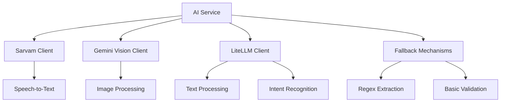

# AI Service Integration Layer

## Overview

The AI Service Integration Layer provides a unified interface for processing multi-modal inputs (text, voice, and image) to extract bill information. It implements comprehensive fallback mechanisms to ensure reliability even when external AI services are unavailable.

## Architecture



## Components

### 1. AIService (Main Orchestrator)

**File**: `app/services/ai_service.py`

The main service that coordinates all AI integrations and implements fallback mechanisms.

**Key Methods**:
- `extract_from_text(text: str) -> BillData`
- `extract_from_voice(audio_data: bytes) -> BillData`
- `extract_from_image(image_data: bytes) -> BillData`
- `validate_extraction(bill_data: BillData) -> ValidationResult`
- `recognize_intent(message: Message, current_step: ConversationStep) -> Dict`
- `health_check() -> Dict[str, bool]`

### 2. SarvamClient (Speech-to-Text)

**File**: `app/services/sarvam_client.py`

Handles voice message transcription using Sarvam AI API.

**Features**:
- Audio transcription with language support (Hindi, English)
- Health monitoring
- Error handling with meaningful messages
- Support for multiple audio formats (WAV, MP3, M4A)

**Configuration**:
```python
# Required environment variable
SARVAM_API_KEY=your_sarvam_api_key
```

### 3. GeminiVisionClient (Image Processing)

**File**: `app/services/gemini_client.py`

Processes bill images using Google's Gemini Vision API.

**Features**:
- Bill information extraction from images
- Image quality validation
- Bill description enhancement
- Support for various image formats

**Configuration**:
```python
# Required environment variable
GEMINI_API_KEY=your_gemini_api_key
```

### 4. LiteLLMClient (Text Processing)

**File**: `app/services/litellm_client.py`

Handles text processing, intent recognition, and validation using LiteLLM with Gemini.

**Features**:
- Bill extraction from text messages
- Intent recognition based on conversation context
- Clarifying question generation
- Semantic validation of extracted data

**Configuration**:
```python
# Uses same Gemini API key
GEMINI_API_KEY=your_gemini_api_key
```

## Usage Examples

### Basic Text Extraction

```python
from app.services.ai_service import AIService

ai_service = AIService()

# Extract bill from text
bill_data = await ai_service.extract_from_text(
    "I spent ₹150 at Pizza Hut for lunch"
)

print(f"Amount: ₹{bill_data.total_amount}")
print(f"Merchant: {bill_data.merchant}")
```

### Voice Processing

```python
# Process voice message
with open("voice_message.wav", "rb") as f:
    audio_data = f.read()

bill_data = await ai_service.extract_from_voice(audio_data)
```

### Image Processing

```python
# Process bill image
with open("bill_image.jpg", "rb") as f:
    image_data = f.read()

bill_data = await ai_service.extract_from_image(image_data)
```

### Intent Recognition

```python
from app.models.schemas import Message
from app.models.enums import MessageType, ConversationStep

message = Message(
    id="msg_123",
    user_id="user_123",
    content="Yes, that's correct",
    message_type=MessageType.TEXT,
    timestamp="2024-01-01T12:00:00Z"
)

intent_data = await ai_service.recognize_intent(
    message, 
    ConversationStep.CONFIRMING_BILL
)

print(f"Intent: {intent_data['intent']}")
print(f"Confidence: {intent_data['confidence']}")
```

## Fallback Mechanisms

### 1. Text Processing Fallback

When LiteLLM fails, the system falls back to regex-based extraction:

```python
# Extracts amounts using regex patterns
amount_pattern = r'₹?(\d+(?:\.\d{2})?)'
amounts = re.findall(amount_pattern, text)
total_amount = max(amounts) if amounts else 0
```

### 2. Intent Recognition Fallback

Basic keyword-based intent recognition when AI fails:

```python
# Simple keyword matching
if "yes" in text.lower():
    return {"intent": "confirm", "confidence": 0.7}
elif "paid" in text.lower():
    return {"intent": "confirm_payment", "confidence": 0.8}
```

### 3. Validation Fallback

Basic validation rules when AI validation fails:

```python
# Check essential requirements
errors = []
if bill_data.total_amount <= 0:
    errors.append("Total amount must be greater than zero")
```

## Error Handling

### Retry Mechanism

All AI operations use exponential backoff retry:

```python
async def _retry_operation(self, operation, *args, **kwargs):
    for attempt in range(self.max_retries):
        try:
            return await operation(*args, **kwargs)
        except Exception as e:
            if attempt < self.max_retries - 1:
                delay = self.retry_delay * (2 ** attempt)
                await asyncio.sleep(delay)
            else:
                raise e
```

### Service-Specific Errors

Each client defines specific error types:

- `SarvamError`: Speech-to-text failures
- `GeminiError`: Image processing failures  
- `LiteLLMError`: Text processing failures
- `AIServiceError`: General AI service failures

## Health Monitoring

### Service Health Checks

```python
# Check all services concurrently
health_status = await ai_service.health_check()

# Returns:
# {
#     "sarvam": True,
#     "gemini": True, 
#     "litellm": False
# }
```

### Individual Service Monitoring

Each client provides its own health check:

```python
# Individual service checks
sarvam_healthy = await sarvam_client.health_check()
gemini_healthy = await gemini_client.health_check()
litellm_healthy = await litellm_client.health_check()
```

## Configuration

### Environment Variables

```bash
# Required for AI services
SARVAM_API_KEY=your_sarvam_api_key
GEMINI_API_KEY=your_gemini_api_key

# Optional LiteLLM configuration
LITELLM_API_KEY=your_litellm_api_key  # Falls back to GEMINI_API_KEY
```

### Service Configuration

```python
# In app/core/config.py
class Settings(BaseSettings):
    sarvam_api_key: str
    gemini_api_key: str
    litellm_api_key: Optional[str] = None
```

## Testing

### Unit Tests

Run the comprehensive test suite:

```bash
python -m pytest tests/test_ai_service.py -v
```

### Integration Testing

Use the example script to test with real APIs:

```bash
python examples/ai_service_example.py
```

### Validation Script

Check if everything is properly configured:

```bash
python validate_ai_service.py
```

## Performance Considerations

### Timeouts

- Sarvam API: 30 seconds
- Gemini Vision: 30 seconds  
- LiteLLM: 30 seconds
- Health checks: 5 seconds

### Concurrent Processing

Health checks run concurrently for faster response:

```python
tasks = [
    ("sarvam", self.sarvam_client.health_check()),
    ("gemini", self.gemini_client.health_check()),
    ("litellm", self.litellm_client.health_check())
]

results = await asyncio.gather(*[task[1] for task in tasks])
```

### Memory Management

- Images are processed in memory without temporary files
- Audio data is streamed directly to Sarvam API
- Large responses are processed incrementally

## Security Considerations

### API Key Management

- All API keys stored in environment variables
- No API keys logged or exposed in responses
- Secure transmission over HTTPS

### Data Privacy

- Audio and image data not stored permanently
- Processed data contains only extracted information
- No raw user content sent to logs

### Input Validation

- Image size and format validation
- Audio format verification
- Text input sanitization

## Troubleshooting

### Common Issues

1. **API Key Errors**
   ```
   Solution: Verify API keys in .env file
   ```

2. **Network Timeouts**
   ```
   Solution: Check internet connection and API service status
   ```

3. **Image Processing Failures**
   ```
   Solution: Ensure image contains clear bill/receipt
   ```

4. **Voice Recognition Issues**
   ```
   Solution: Use clear audio with minimal background noise
   ```

### Debug Mode

Enable detailed logging:

```python
import logging
logging.getLogger("app.services").setLevel(logging.DEBUG)
```

### Fallback Testing

Test fallback mechanisms by simulating API failures:

```python
# Mock API failure to test fallback
with patch.object(ai_service.litellm_client, 'extract_bill_from_text', 
                 side_effect=Exception("API down")):
    result = await ai_service.extract_from_text("₹100 bill")
    # Should use regex fallback
```

## Future Enhancements

### Planned Features

1. **Multi-language Support**
   - Support for regional Indian languages
   - Automatic language detection

2. **Enhanced Image Processing**
   - OCR fallback for Gemini Vision
   - Support for handwritten bills

3. **Caching Layer**
   - Cache frequent AI responses
   - Reduce API calls for similar inputs

4. **Batch Processing**
   - Process multiple bills simultaneously
   - Bulk image processing

### Performance Optimizations

1. **Response Caching**
2. **Connection Pooling**
3. **Async Optimization**
4. **Memory Usage Reduction**