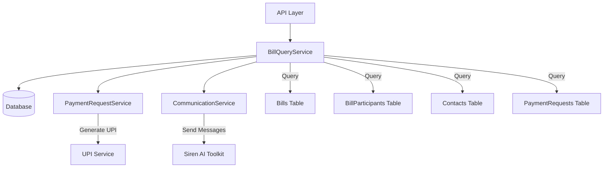

# Bill Query Service Documentation

## Overview

The BillQueryService provides comprehensive bill history and status querying functionality for the Bill Splitting Agent. It implements requirements 6.1 through 6.5, enabling users to retrieve bill information, track payment status, and send payment reminders.

## Features

- **Bill History Retrieval** (Requirement 6.1): Query user's bill history with flexible filtering
- **Payment Status Display** (Requirement 6.2): View detailed payment status for each bill
- **Complete Bill Information** (Requirement 6.3): Access comprehensive bill details including items and participants
- **Payment Reminder System** (Requirement 6.4): Send reminders to unpaid participants
- **User Isolation** (Requirement 6.5): Ensure users can only access their own bills

## Architecture



## Core Methods

### get_user_bills(user_id, filters=None)

Retrieves bill history for a user with optional filtering.

**Parameters:**
- `user_id` (str): User's unique identifier
- `filters` (BillFilters, optional): Filtering criteria

**Returns:**
- `List[BillSummary]`: List of bill summaries

**Example:**
```python
# Get all bills
bills = await service.get_user_bills(user_id)

# Get filtered bills
filters = BillFilters(
    status=BillStatus.ACTIVE,
    date_from=datetime.now() - timedelta(days=30),
    min_amount=Decimal("50.00")
)
filtered_bills = await service.get_user_bills(user_id, filters)
```

### get_bill_status(user_id, bill_id)

Retrieves detailed payment status for a specific bill.

**Parameters:**
- `user_id` (str): User's unique identifier
- `bill_id` (str): Bill's unique identifier

**Returns:**
- `BillStatusInfo | None`: Detailed status information or None if not found

**Example:**
```python
status = await service.get_bill_status(user_id, bill_id)
if status:
    print(f"Total: ₹{status.total_amount}")
    print(f"Paid: ₹{status.total_paid}")
    print(f"Completion: {status.completion_percentage}%")
```

### get_bill_details(user_id, bill_id)

Retrieves comprehensive bill information including items and participants.

**Parameters:**
- `user_id` (str): User's unique identifier
- `bill_id` (str): Bill's unique identifier

**Returns:**
- `BillDetails | None`: Complete bill information or None if not found

**Example:**
```python
details = await service.get_bill_details(user_id, bill_id)
if details:
    print(f"Merchant: {details.merchant}")
    print(f"Items: {len(details.items)}")
    print(f"Participants: {len(details.participants)}")
```

### send_payment_reminders(user_id, bill_id, participant_ids=None)

Sends payment reminders to unpaid participants.

**Parameters:**
- `user_id` (str): User's unique identifier
- `bill_id` (str): Bill's unique identifier
- `participant_ids` (List[str], optional): Specific participants to remind

**Returns:**
- `Dict[str, Any]`: Reminder sending results

**Example:**
```python
# Send reminders to all unpaid participants
result = await service.send_payment_reminders(user_id, bill_id)

# Send reminders to specific participants
result = await service.send_payment_reminders(
    user_id, bill_id, ["participant_id_1", "participant_id_2"]
)

print(f"Sent {result['reminded_count']} reminders")
```

### get_unpaid_participants(user_id, bill_id)

Retrieves list of participants who haven't paid yet.

**Parameters:**
- `user_id` (str): User's unique identifier
- `bill_id` (str): Bill's unique identifier

**Returns:**
- `List[ParticipantDetails]`: List of unpaid participants

## Data Models

### BillSummary

Basic bill information for list views:

```python
class BillSummary(BaseModel):
    id: str
    description: str
    total_amount: Decimal
    participant_count: int
    paid_count: int
    status: BillStatus
    created_at: datetime
    bill_date: Optional[datetime] = None
    merchant: Optional[str] = None
```

### BillStatusInfo

Detailed status information:

```python
class BillStatusInfo(BaseModel):
    id: str
    description: str
    total_amount: Decimal
    status: BillStatus
    created_at: datetime
    participants: List[ParticipantDetails]
    total_paid: Decimal
    remaining_amount: Decimal
    completion_percentage: float
```

### BillDetails

Complete bill information:

```python
class BillDetails(BaseModel):
    id: str
    description: str
    total_amount: Decimal
    currency: str = "INR"
    merchant: Optional[str] = None
    bill_date: Optional[datetime] = None
    created_at: datetime
    status: BillStatus
    items: List[BillItem]
    participants: List[ParticipantDetails]
```

### BillFilters

Filtering criteria for bill queries:

```python
class BillFilters(BaseModel):
    status: Optional[BillStatus] = None
    date_from: Optional[datetime] = None
    date_to: Optional[datetime] = None
    min_amount: Optional[Decimal] = None
    max_amount: Optional[Decimal] = None
    merchant: Optional[str] = None
    limit: int = Field(default=50, le=100)
    offset: int = Field(default=0, ge=0)
```

## Usage Examples

### Basic Bill Query

```python
from app.services.bill_query_service import BillQueryService

# Initialize service
service = BillQueryService(db_session, payment_service, communication_service)

# Get user's recent bills
bills = await service.get_user_bills(user_id)
for bill in bills:
    print(f"{bill.description}: ₹{bill.total_amount}")
    print(f"Status: {bill.status}, Paid: {bill.paid_count}/{bill.participant_count}")
```

### Advanced Filtering

```python
from datetime import datetime, timedelta
from app.models.schemas import BillFilters
from app.models.enums import BillStatus

# Filter for active bills from last month above ₹100
filters = BillFilters(
    status=BillStatus.ACTIVE,
    date_from=datetime.now() - timedelta(days=30),
    min_amount=Decimal("100.00"),
    merchant="Restaurant",
    limit=20
)

bills = await service.get_user_bills(user_id, filters)
```

### Payment Status Tracking

```python
# Get detailed status
status = await service.get_bill_status(user_id, bill_id)
if status:
    print(f"Bill: {status.description}")
    print(f"Progress: {status.completion_percentage:.1f}%")
    
    for participant in status.participants:
        emoji = "✅" if participant.payment_status == PaymentStatus.CONFIRMED else "⏳"
        print(f"{emoji} {participant.name}: ₹{participant.amount_owed}")
```

### Sending Reminders

```python
# Get unpaid participants
unpaid = await service.get_unpaid_participants(user_id, bill_id)
print(f"Found {len(unpaid)} unpaid participants")

# Send reminders
result = await service.send_payment_reminders(user_id, bill_id)
if result["success"]:
    print(f"Sent {result['reminded_count']} reminders")
    for detail in result["details"]:
        print(f"- {detail['name']}: {detail['status']}")
```

## Error Handling

The service implements comprehensive error handling:

### Invalid Input Handling

```python
# Invalid UUID format
bills = await service.get_user_bills("invalid-uuid")
# Returns: []

# Non-existent bill
status = await service.get_bill_status(user_id, "non-existent-id")
# Returns: None
```

### User Isolation (Requirement 6.5)

```python
# User trying to access another user's bill
other_user_bills = await service.get_user_bills(other_user_id)
# Returns: [] (empty list)

other_user_status = await service.get_bill_status(other_user_id, my_bill_id)
# Returns: None
```

### Communication Failures

```python
# Reminder sending with fallback
result = await service.send_payment_reminders(user_id, bill_id)
# Automatically tries WhatsApp first, then SMS fallback
# Returns detailed results including failures
```

## Security Considerations

### User Isolation

- All queries are filtered by user_id to ensure data isolation
- Users can only access bills they created
- No cross-user data leakage

### Data Protection

- Sensitive contact information is encrypted at rest
- Phone numbers are handled securely
- No payment credentials are stored

### Rate Limiting

- Consider implementing rate limiting for reminder functionality
- Prevent spam by tracking reminder frequency
- Implement cooldown periods between reminders

## Performance Considerations

### Database Optimization

- Queries use appropriate indexes on user_id, created_at, status
- Eager loading with joinedload for related data
- Pagination support for large result sets

### Caching

Consider caching for frequently accessed data:

```python
# Cache bill summaries for short periods
# Cache participant lists for active bills
# Cache payment status for real-time updates
```

## Integration

### With Payment Request Service

```python
# Service automatically integrates with PaymentRequestService
# for generating UPI links when sending reminders
```

### With Communication Service

```python
# Uses CommunicationService for sending reminders
# Supports WhatsApp/SMS fallback through Siren integration
```

## Testing

### Unit Tests

Run the test suite:

```bash
pytest tests/test_bill_query_service.py -v
```

### Validation Script

Run the validation script:

```bash
python validate_bill_query_service.py
```

### Example Usage

Run the example:

```bash
python examples/bill_query_service_example.py
```

## Configuration

### Dependencies

The service requires:

- Database session (SQLAlchemy)
- PaymentRequestService instance
- CommunicationService instance

### Environment Variables

No specific environment variables required, but depends on:

- Database connection settings
- Siren API configuration
- UPI service configuration

## Monitoring and Logging

### Logging

The service logs:

- Query operations and results
- Reminder sending attempts and results
- Error conditions and recovery attempts
- Performance metrics

### Metrics

Track:

- Query response times
- Reminder success rates
- Error rates by operation type
- User activity patterns

## Future Enhancements

### Potential Improvements

1. **Advanced Analytics**: Bill spending patterns, payment behavior analysis
2. **Bulk Operations**: Batch reminder sending, bulk status updates
3. **Export Functionality**: CSV/PDF export of bill history
4. **Notification Preferences**: User-configurable reminder settings
5. **Payment Insights**: Detailed payment analytics and reporting

### API Extensions

1. **GraphQL Support**: More flexible querying capabilities
2. **Real-time Updates**: WebSocket support for live status updates
3. **Mobile Optimization**: Optimized endpoints for mobile apps
4. **Third-party Integrations**: Export to accounting software

## Troubleshooting

### Common Issues

1. **Empty Results**: Check user_id format and database connectivity
2. **Permission Errors**: Verify user isolation is working correctly
3. **Reminder Failures**: Check communication service configuration
4. **Performance Issues**: Review query optimization and indexing

### Debug Mode

Enable detailed logging:

```python
import logging
logging.getLogger('app.services.bill_query_service').setLevel(logging.DEBUG)
```